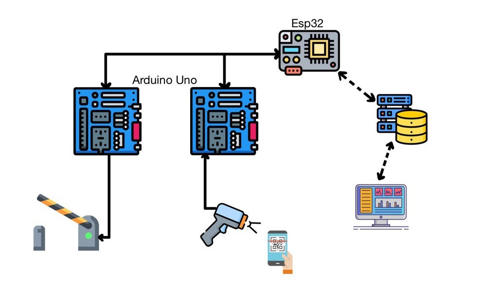
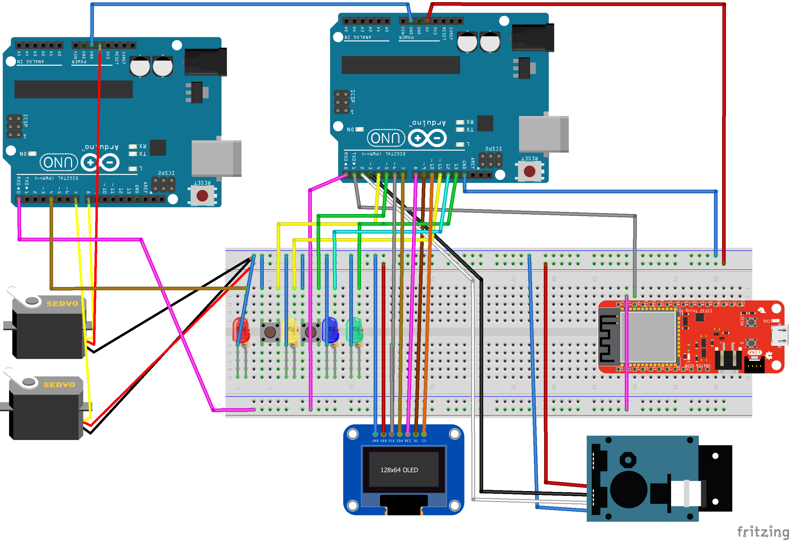
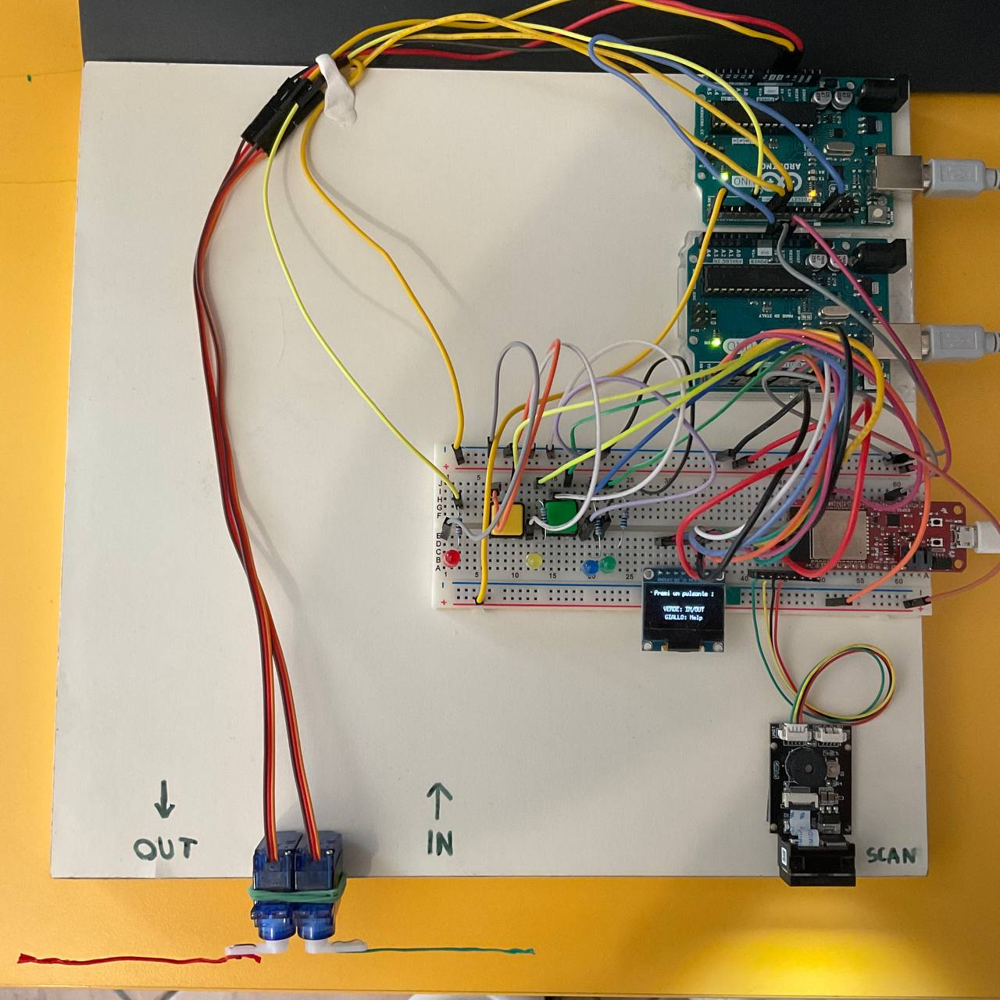

    
# Proggetto finale Prototipizzazione con Arduino

## Indice
- [Descrizione progetto](#descrizione-progetto) 
	- [Schema progetto](#schema-progetto) 
	- [Schema ciruito](#schema-circuito) 
	- [Implementazione fisica](#implementazione-fisica) 
- [Requisiti](#requisiti)
-  [Bibliografia](#bibliografia)
-  [Licenza](#licenza)

## Descrizione progetto
Il progetto implementa un sistema di autenticazione di un parcheggio pensato per controllare l’accesso
di dipendenti di un ufficio o studenti di un università. L’autenticazione avviene tramite lettura di codici
QR associati ad ogni utente. Oltre a permettere l’autenticazione, il sistema registra i tempi di utilizzo
del parcheggio di ogni utente e rende possibili consultare queste statistiche da un pannello di controllo.
Tramite quest’ultimo è possibile anche ricevere notifiche di un eventuale richiesta di aiuto proveniente
dal totem del parcheggio, per poter essere informati e provvedere ad assistere l’utente.
Attraverso la presenza di un display e vari led, è presente anche un intefraccia per l’utente del parcheggio
che potrà, utilizzando dei pulsanti, accedere a diverse funzionalità:
- **Ingresso**: l’utente potrà impostare il circuito in modalità ingresso per permettere di autenticare la
propria utenza e far alzare la sbarra corretta ed entrare all’interno del parcheggio;
- **Uscita**: l’utente potrà impostare il circuito in modalità uscita per permettere di inserire nel sistema
quali tra gli utenti sta lasciando il parcheggio e far alzare la sbarra corretta;
- **Richiesta di aiuto**: l’utente potrà, in caso di necessità, aprire una richiesta di assistenza, la quale
potrà essere chiusa direttamente dall’utente al totem, oppure tramite il pannello di controllo gestito
da un operatore.

Questa interfaccia presenta informazioni che ne facilitano l’utilizzo informando l’utente di come operare,
di ciò che sta succedendo o dei tempi di attesa necessari.
Per la realizzazione ho utilizzato 2 schede Arduino Uno e una scheda esp32, collegati in seriale (RXTX). L’esp oltre a permettere il collegamento ad internet, si occupa di scambiare i dati con un realtime
database creato con firebase.
Il resto del circuito è così diviso:
- **Arduino Uno A**: fornisce un’interfaccia all’utente e permette la lettura del qr code, inviando
questo dato e la modalità selezionata dall’utente in seriale, attendendo come risposta un riscontro
per poi informare l’utente tramite led e display;
- **Arduino Uno B**: svolge l’operazione di apertura e chiusura delle due sbarre relative all’ingresso
e all’uscita, in base ai dati provenienti dall’esp. Questa parte di circuito controlla anche un led di
errore/avviso che completa l’interfaccia per l’utente.
Infine, ho creato un pannello di controllo implementando un interfaccia web in python, sfruttando anche
flask e plotly.

### Schema progetto

### Schema circuito

### Implementazione fisica

## Requisiti
Si consiglia l'utilizzo di Arduino IDE.
Librerie necessarie:
 - Per il codice arduino:
    - Firebase_ESP_Client
    - Wifi
    - Servo
    - U8g
    - SoftwareSerial
 - Per il codice python:
    - firebase_admin
    - plotly
    - flask
    
Inoltre é necessaria l'installazione della board esp32.

## Bibliografia e riferimenti

Per apprendere l'utilizzo di alcuni componenti, come il sensore gm65, ho utilizzato alcune guide di questo canale youtube: [https://youtube.com/@zeppelinmaker](https://youtube.com/@zeppelinmaker)

 Per l'idea su come utilizzare firebase intefacciato con esp32 mi sono ispirato a questo progetto, specialmente la parte dove con il database controllano lo stato di un led, per tramutare il suo utilizzo a ciò che più faceva comodo a me: [https://youtu.be/aO92B-K4TnQ](https://youtu.be/aO92B-K4TnQ)

Per mostrare a video sul display oled ho fatto uso della libreria u8g, consultando la documentazione presente su github: [https://github.com/olikraus/u8glib/wiki/userreference](https://github.com/olikraus/u8glib/wiki/userreference)

### Licenza
MIT License

Copyright (c) 2023 Cremonini Davide

Permission is hereby granted, free of charge, to any person obtaining a copy
of this software and associated documentation files (the "Software"), to deal
in the Software without restriction, including without limitation the rights
to use, copy, modify, merge, publish, distribute, sublicense, and/or sell
copies of the Software, and to permit persons to whom the Software is
furnished to do so, subject to the following conditions:

The above copyright notice and this permission notice shall be included in all
copies or substantial portions of the Software.

THE SOFTWARE IS PROVIDED "AS IS", WITHOUT WARRANTY OF ANY KIND, EXPRESS OR
IMPLIED, INCLUDING BUT NOT LIMITED TO THE WARRANTIES OF MERCHANTABILITY,
FITNESS FOR A PARTICULAR PURPOSE AND NONINFRINGEMENT. IN NO EVENT SHALL THE
AUTHORS OR COPYRIGHT HOLDERS BE LIABLE FOR ANY CLAIM, DAMAGES OR OTHER
LIABILITY, WHETHER IN AN ACTION OF CONTRACT, TORT OR OTHERWISE, ARISING FROM,
OUT OF OR IN CONNECTION WITH THE SOFTWARE OR THE USE OR OTHER DEALINGS IN THE
SOFTWARE.

